<div align="center">
  
</div>

<div align="center">
  
  # 🚀 DevOps Enthusiast | ☁️ AWS Cloud Learner | 💻 Java Developer
  
  
  
</div>

<div align="center">
  
  [](https://github.com/sabari432)
  [](https://github.com/sabari432)
  [](https://github.com/sabari432)
  
</div>

<div align="center">
  
  [](https://www.linkedin.com/in/sabare-eswaran-346902267)
  [](mailto:sabareeswaran.n26@gmail.com)
  [](https://github.com/sabari432)
  [](#)
  
</div>

---


##  About Me

```typescript
const sabareeswaran = {
    pronouns: "He" | "Him",
    role: "DevOps Engineer",
    location: "India 🇮🇳",
    education: "Final Year Student",
    currentFocus: ["DevOps", "Cloud Computing", "Automation"],
    
    workExperience: {
        role: "DevOps Engineer",
        company: "Startup",
        type: "Real-world Experience"
    },
    
    learning: [
        "Kubernetes Orchestration",
        "Terraform (IaC)",
        "AWS Solutions Architecture",
        "Advanced Jenkins Pipelines"
    ],
    
    achievements: [
        "Built 5+ production websites",
        "Implemented CI/CD pipelines",
        "Hands-on with 15+ AWS services"
    ],
    
    funFact: "I love watching Breaking Bad 😎🔥"
};
```


##  Tech Stack & Tools

<div align="center">

### ☁️ Cloud & DevOps


### 💻 Programming Languages


### 🛠️ Tools & Technologies


### 📊 Monitoring & Observability


</div>


## 📊 GitHub Statistics

<div align="center">
   
  
</div>

<div align="center">
  
</div>

<div align="center">
  
</div>


## 🏆 GitHub Trophies

<div align="center">
  
</div>


## 🎯 Skills Matrix

<div align="center">

<table>
<tr>
<td width="50%">

### ☁️ AWS Services (15+)
```yaml
Compute:
  - EC2, Lambda, ECS, EKS
  
Storage:
  - S3, EBS, EFS
  
Database:
  - RDS, DynamoDB
  
Networking:
  - VPC, Route53, CloudFront
  
Management:
  - CloudFormation, CloudWatch
  - IAM, Systems Manager
```

</td>
<td width="50%">

### 🔄 DevOps Practices
```yaml
CI/CD:
  - Jenkins Pipelines
  - GitHub Actions
  - GitLab CI/CD
  
IaC:
  - Terraform
  - CloudFormation
  - Ansible
  
Containerization:
  - Docker & Docker Compose
  - Kubernetes
```

</td>
</tr>
</table>

</div>


## 🚀 Highlighted Projects & Achievements

<div align="center">

<table>
<tr>
<td align="center" width="33%">


### 💻 Web Development
Built **5+ production websites** for Java developers with modern tech stacks

</td>
<td align="center" width="33%">


### 🔄 CI/CD Pipelines
Implemented **automated pipelines** with testing, building & deployment

</td>
<td align="center" width="33%">


### ☁️ Cloud Experience
Hands-on with **15+ AWS services** in real production environments

</td>
</tr>
</table>

</div>


## 📈 Contribution Activity

<!--START_SECTION:activity-->
<div align="center">
  
### 🔥 Recent Activity Highlights

🎯 **Learning Kubernetes** - Implementing container orchestration  
🛠️ **Building CI/CD Pipelines** - Automating deployment workflows  
☁️ **AWS Infrastructure** - Designing scalable cloud solutions  
🐳 **Docker Projects** - Containerizing applications  
📚 **DevOps Best Practices** - Continuous improvement journey

</div>
<!--END_SECTION:activity-->


## 💼 Professional Experience

```mermaid
graph LR
    A[🎓 Student] --> B[💻 Java Developer]
    B --> C[☁️ Cloud Learner]
    C --> D[🚀 DevOps Engineer]
    D --> E[🏢 Startup Experience]
    E --> F[🎯 Building Production Systems]
    
    style A fill:#e1f5ff
    style B fill:#bbdefb
    style C fill:#90caf9
    style D fill:#64b5f6
    style E fill:#42a5f5
    style F fill:#2196f3
```

<div align="center">



</div>


## 🌟 What I'm Up To

<div align="center">

| 🔭 Currently Working On | 🌱 Learning | 👯 Looking to Collaborate On |
|:---:|:---:|:---:|
| CI/CD Automation | Kubernetes | Open Source DevOps Tools |
| AWS Infrastructure | Terraform | Cloud Native Projects |
| Containerization | Service Mesh | Infrastructure Automation |

</div>


## 📫 Let's Connect & Collaborate!

<div align="center">
  
  [](https://www.linkedin.com/in/sabare-eswaran-346902267)
  [](mailto:sabareeswaran.n26@gmail.com)
  [](https://github.com/sabari432)
  
  <br/>
  
  
  
  
  
</div>


<div align="center">

### 💭 Quote of the Day


### 😂 Random Dev Meme


</div>


<div align="center">
  
  ## 🐍 Watch My Contribution Snake Eat My Contributions!
  
  
  
  <i>⚡ Fun Fact: I love watching Breaking Bad 😎🔥</i>
  
  <br/>
  
  **"The best way to predict the future is to automate it!"** 💻🚀
  
</div>


---

<div align="center">
  
  ### Show some ❤️ by starring some of my repositories!
  
  
  
  
</div>
