<div align="center">
  
</div>

<div align="center">
  
  # 💻 Software Engineer | 🚀 DevOps Practitioner | ☁️ AWS Enthusiast
  
  
  
</div>

<div align="center">
  
  [](https://github.com/sabari432)
  [](https://github.com/sabari432)
  [](https://github.com/sabari432)
  
</div>

<div align="center">
  
  [](https://www.linkedin.com/in/sabare-eswaran-346902267)
  [](mailto:sabareeswaran.n26@gmail.com)
  [](https://github.com/sabari432)
  [](#)
  
</div>

---


##  About Me

```typescript
const sabareeswaran = {
    pronouns: "He" | "Him",
    role: "Software Engineer",
    location: "India 🇮🇳",
    education: "Final Year Student",
    currentFocus: ["Software Development", "DevOps", "Cloud Computing"],
    
    workExperience: {
        role: "Software Engineer + DevOps",
        company: "Startup",
        type: "Real-world Experience",
        responsibilities: [
            "Building web applications",
            "Managing deployments",
            "Implementing CI/CD"
        ]
    },
    
    expertise: {
        development: ["Java", "Web Development", "Backend Systems"],
        devops: ["CI/CD Pipelines", "Docker", "AWS", "Jenkins"],
        learning: ["Kubernetes (Just Started)", "Advanced Terraform"]
    },
    
    achievements: [
        "Built 5+ production websites",
        "Implemented automated CI/CD pipelines",
        "Hands-on with 10-15 AWS services",
        "Managing production deployments"
    ],
    
};
```


### ☁️ AWS Services (10-15)
```yaml
Compute:
  - EC2, Lambda
  
Storage:
  - S3, EBS
  
Database:
  - RDS
  
Networking:
  - VPC, Route53
  
Management:
  - CloudFormation, CloudWatch
  - IAM
```

</td>
<td width="50%">

### 🔄 DevOps Skills
```yaml
CI/CD:
  - Jenkins Pipelines
  - GitHub Actions
  - Automated Deployments
  
Containerization:
  - Docker & Docker Compose
  
IaC:
  - Terraform (Learning)
  
Currently Learning:
  - Kubernetes (Just Started!)
```

</td>
</tr>
</table>

</div>


## 🚀 Highlighted Projects & Achievements

<div align="center">

<table>
<tr>
<td align="center" width="33%">


### 💻 Software Development
Built **5+ production websites** with modern frameworks and best practices

</td>
<td align="center" width="33%">


### 🔄 CI/CD & Automation
Implemented **automated pipelines** for building, testing & deployment

</td>
<td align="center" width="33%">


### ☁️ Cloud & DevOps
Working with **10-15 AWS services** and managing production deployments

</td>
</tr>
</table>

</div>


## 📈 Contribution Activity

<!--START_SECTION:activity-->
<div align="center">
  
### 🔥 Recent Activity Highlights

🎯 **Learning Kubernetes** - Just started container orchestration journey  
🛠️ **Building CI/CD Pipelines** - Automating deployment workflows  
☁️ **AWS Infrastructure** - Managing cloud resources  
🐳 **Docker Projects** - Containerizing applications  
💻 **Web Development** - Building production-ready applications

</div>
<!--END_SECTION:activity-->


## 💼 Professional Experience

```mermaid
graph LR
    A[🎓 Student] --> B[💻 Java Developer]
    B --> C[🌐 Full Stack Web Dev]
    C --> D[🚀 DevOps Practices]
    D --> E[☁️ AWS & Cloud]
    E --> F[🏢 Software Engineer]
    F --> G[📚 Learning Kubernetes]
    
    style A fill:#e1f5ff
    style B fill:#bbdefb
    style C fill:#90caf9
    style D fill:#64b5f6
    style E fill:#42a5f5
    style F fill:#2196f3
    style G fill:#1976d2
```

<div align="center">



</div>


## 🌟 What I'm Up To

<div align="center">

| 🔭 Currently Working On | 🌱 Learning | 👯 Looking to Collaborate On |
|:---:|:---:|:---:|
| Web Applications | Kubernetes Basics | Open Source Projects |
| CI/CD Automation | Advanced Terraform | DevOps Tools |
| AWS Infrastructure | Container Orchestration | Cloud Solutions |

</div>


## 📫 Let's Connect & Collaborate!

<div align="center">
  
  [](https://www.linkedin.com/in/sabare-eswaran-346902267)
  [](mailto:sabareeswaran.n26@gmail.com)
  [](https://github.com/sabari432)
  
  <br/>
  
  
  
  
  
</div>


<div align="center">

### 💭 Quote of the Day


---
